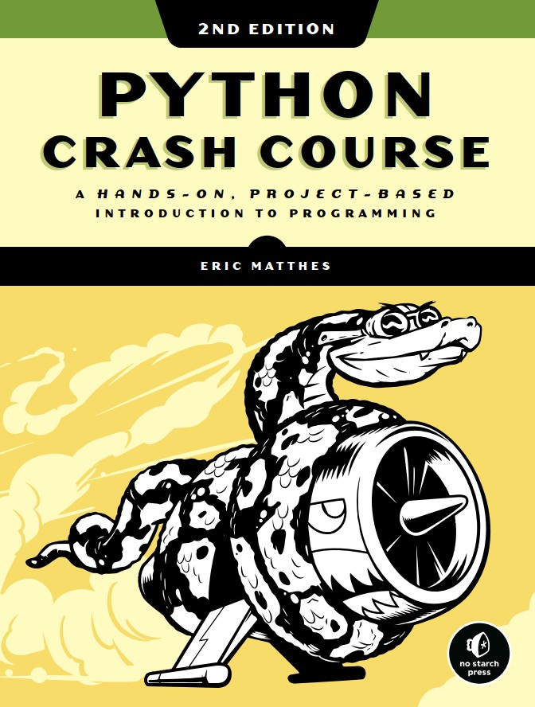

# Programação em Python

__Prof. Eduardo Ono__

&nbsp;

## Descrição

> Fundamentos de programação em linguagem Python.

 

## Pré-Requisitos

* Arquitetura e Organização de Computadores
* Introdução à Programação

 

## Conteúdo Programático

| Aula | Conteúdo |
| :-: | --- |
| 01 | Introdução à Programação em Linguagem Python
| 02 | Tipos de Dados e Variáveis
| 03 | Álgebra dos Inteiros
| 04 | Estruturas de Controle: Estruturas de Decisão
| 05 | Estruturas de Controle: Estruturtas de Repetição
| 06 | Funções Definidas pelo Usuário
| 07 | Recursão
| 08 | Containers/Iterables: Listas, Dicionários e Tuplas
| 09 | Programação Orientada a Objetos (POO)
| 10 | POO - Classes e Objetos
| 11 | POO - Herança e Polimorfismo
| 12 | Estrutura de Dados (ED) - Fundamentos
| 13 | ED - Pilhas e Filas
| 14 | ED - Recursividade
| 15 | ED - Árvores
| 16 | ED - Ordenação
| 17 | GUI - Tkinter

 

## Recursos

* Google Colab

### Softwares

* Python 3.9+

* Microsoft Visual Studio Code - https://code.visualstudio.com

  * https://code.visualstudio.com/shortcuts/keyboard-shortcuts-windows.pdf

  * https://www.shortcutfoo.com/app/dojos/vscode-win/cheatsheet

  * https://docs.emmet.io/cheat-sheet/

  * https://vscodecandothat.com/

 

## Bibliografia Básica

| Capa | Descrição |
| :-: | --- |
|  | [DOWNEY-2e_2016] DOWNEY, Allen; [__Pense em Python__](https://penseallen.github.io/PensePython2e/), tradução da 2. ed., Novatec Editora, 2016. Download (epub): https://github.com/PenseAllen/PensePython2e/raw/master/ebooks/PenseEmPython2e.epub
|  | [DOWNEY-2e_2015] DOWNEY, Allen; [__Think Python, 2. ed.__](https://greenteapress.com/wp/think-python-2e/), O'Reilly Media, 2016. Download: http://greenteapress.com/thinkpython2/thinkpython2.pdf Resenha: https://www.youtube.com/watch?v=BdwJvs-96YU
|  | [MATTHES-2e_2019] MATTHES, Eric; [__Python Crash Course, 2. ed.__](https://archive.org/details/python-crash-course-a-hands-on-project-based-introduction-to-programming_202204), San Francisco, No Starch Press, 2019. Resenha: https://www.youtube.com/watch?v=ubV-8EYzTyc

&nbsp;

## Bibliografia Complementar

&nbsp;
