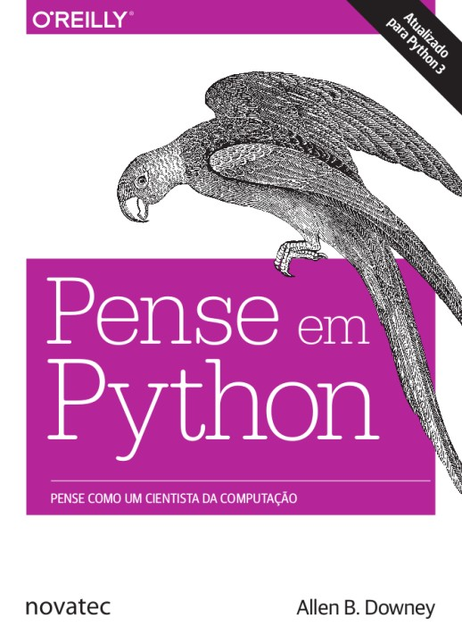
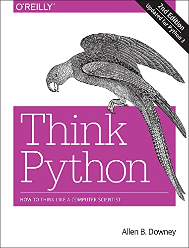

<h1 align="center">
Programação em Python
</h1>

<h4 align="center">Prof. Eduardo Ono</h4>

 

## Descrição

> Fundamentos de programação em linguagem Python.

 

## Pré-Requisitos

* Arquitetura e Organização de Computadores
* Introdução à Programação

 

## Conteúdo Programático

| Aula | Conteúdo |
| :-: | --- |
| 01 | Introdução à Programação em Linguagem Python
| 02 | Tipos de Dados e Variáveis
| 03 | Álgebra dos Inteiros
| 04 | Estruturas de Controle: Estruturas de Decisão
| 05 | Estruturas de Controle: Estruturtas de Repetição
| 06 | Funções Definidas pelo Usuário
| 07 | Recursão
| 08 | Programação Orientada a Objetos (POO)
| 09 | POO - Classes e Objetos
| 10 | POO - Herança e Polimorfismo
| 11 | Estrutura de Dados (ED) - Fundamentos
| 12 | ED - Contaioners: Listas, Dicionários e Tuplas
| 13 | ED - Pilhas e Filas
| 14 | ED - Recursividade
| 14 | ED - Árvores
| 13 | ED - Ordenação
|    | GUI - Tkinter
| -- | Teoria dos Grafos e suas Aplicações
| -- | Desenvolvimento Web
| -- | Desenvolvimento de Games em Python

 

## Recursos

* Google Colab

### Softwares

* Python 3.9+

* Microsoft Visual Studio Code - https://code.visualstudio.com

  * https://code.visualstudio.com/shortcuts/keyboard-shortcuts-windows.pdf

  * https://www.shortcutfoo.com/app/dojos/vscode-win/cheatsheet

  * https://docs.emmet.io/cheat-sheet/

  * https://vscodecandothat.com/

 

## Bibliografia Básica

| Capa | Descrição |
| :-: | --- |
|  | [DOWNEY-2e_2016] DOWNEY, Allen; [__Pense em Python__](https://penseallen.github.io/PensePython2e/), tradução da 2. ed., Novatec Editora, 2016. Download (epub): https://github.com/PenseAllen/PensePython2e/raw/master/ebooks/PenseEmPython2e.epub
|  | [DOWNEY-2e_2015] DOWNEY, Allen; <strong>[Think Python, 2. ed.](https://greenteapress.com/wp/think-python-2e/)</strong>, O'Reilly Media, 2016. Download: http://greenteapress.com/thinkpython2/thinkpython2.pdf Resenha: https://www.youtube.com/watch?v=BdwJvs-96YU
|  | [DOWNEY-2e_2015] DOWNEY, Allen; <strong>[Think Python, 2. ed.](https://greenteapress.com/wp/think-python-2e/)</strong>, O'Reilly Media, 2016. Download: http://greenteapress.com/thinkpython2/thinkpython2.pdf Resenha: https://www.youtube.com/watch?v=BdwJvs-96YU

 
