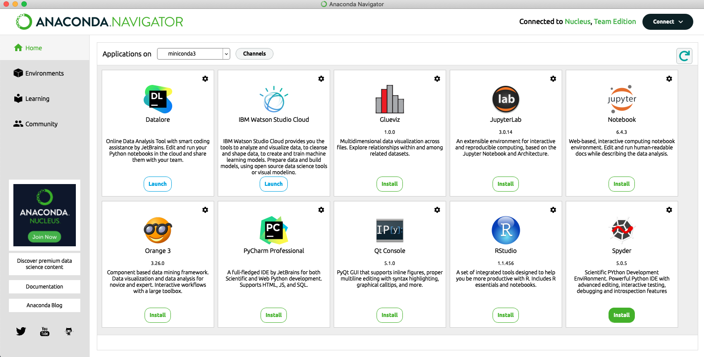

<h1 align="center">
Anaconda
</h1>

<h4 align="center">Prof. Eduardo Ono</h4>

 

## Overview

* O Anaconda é uma suite de ferramentas de desenvolvimento para análise de dados e machine learning.

 

## Instalação no Windows

* Download: 

### Vídeos de Apoio

| Thumb | Descrição |
| :-: | --- |
|  | [Hashtag Programação] [__Instalando o Jupyter - Pacote Anaconda para Programação em Python__](https://www.youtube.com/watch?v=3oYEesMpAQQ) (14:53, YouTube, Jan/2021)
|  | [Hashtag Programação] [__Instalando o Jupyter - Pacote Anaconda para Programação em Python__](https://www.youtube.com/watch?v=_eK0z5QbpKA) (14:53, YouTube, Jan/2021)

* https://www.youtube.com/watch?v=kegL0pBpHsM

 
