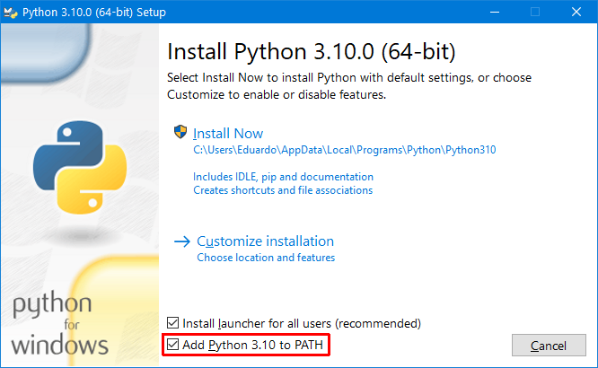

<div  align="center">

# Instalação "Default" do Python

#### Prof. Eduardo Ono

</div>

&nbsp;

## Descrição

* A instalação do Python contempla um interpretador de linha de comado.

&nbsp;

## Instalação do Python

* Download: https://www.python.org/downloads/

* Versão recomendada (até o presente momento): 3.9.13

* Instalação

  * Caso seja a única instalação do Python no computador, marcar a opção para incluir o Python no PATH.

    

### Vídeos de Apoio

| Thumb | Descrição |
| :-: | --- |
| [](https://www.youtube.com/watch?v=r29uzZpIlWI) | <sup>[Hashtag Programação]</sup><br>[__Pip Install no Python - O que é e Para que Serve?__](https://www.youtube.com/watch?v=r29uzZpIlWI)<br><sub>(14:53, YouTube, Mar/2022)</sub>
| [](https://www.youtube.com/watch?v=_XszPRFHQQ4) | <sup>[CodeShow (Bruno Rocha)]</sup><br>[__Gestão de pacotes e ambientes no Python / Virtualenv, Pip, Pipenv, Poetry - Codeshow #011__](https://www.youtube.com/watch?v=_XszPRFHQQ4)<br><sub>(51:15, YouTube, Fev/2020)</sub>

&nbsp;

## Gerenciamento de Pacotes com o Pip

### Pincipais comandos

* Exibir a versão instalada do Pip

```sh
pip --version
```

* Para instalar um novo pacote

```sh
pip install nome_do_pacote[=versão]
```

* * Exemplo

    ```sh
    pip install pandas
    ```

* Listar bibliotecas instaladas

```sh
pip list
```

* Exportar bibliotecas para o arquivo `requirements.txt`

```sh
pip freeze > requirements.txt
```

&nbsp;

### Vídeos de Apoio

| Thumb | Descrição |
| :-: | --- |
| [](https://www.youtube.com/watch?v=r29uzZpIlWI) | <sup>[Hashtag Programação]</sup><br>[__Pip Install no Python - O que é e Para que Serve?__](https://www.youtube.com/watch?v=r29uzZpIlWI)<br><sub>(14:53, YouTube, Mar/2022)</sub>
| [](https://www.youtube.com/watch?v=6W6iY7uUu34) | <sup>[Jeffery Frederic]</sup><br>[__Python Tutorial: Using Virtual Environments With GitHub__](https://www.youtube.com/watch?v=6W6iY7uUu34)<br><sub>(11:00, YouTube, Ago/2021)</sub>

<br>
