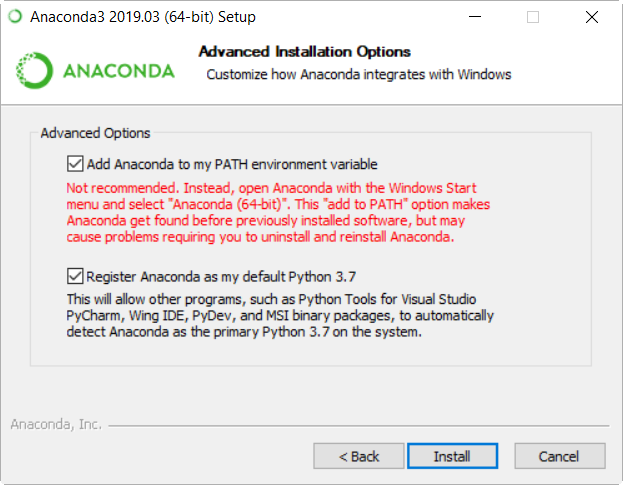

> Ciência de Dados > Conteúdo > Ambiente de Desenvolvimento

# Instalação do JupyterLab no Windows

Prof. Eduardo Ono

 

 

## Opção 2: Anaconda

* Overview

  * Incluído no Anaconda:

    * Python (verificar a versão contida)
    * JupyterLab
    * Jupyter Notebook

* Download

  * https://www.anaconda.com/products/individual#Downloads

* Instalação

  * Instalar com as opções padrão excetuando a opção a seguir:

    

 
